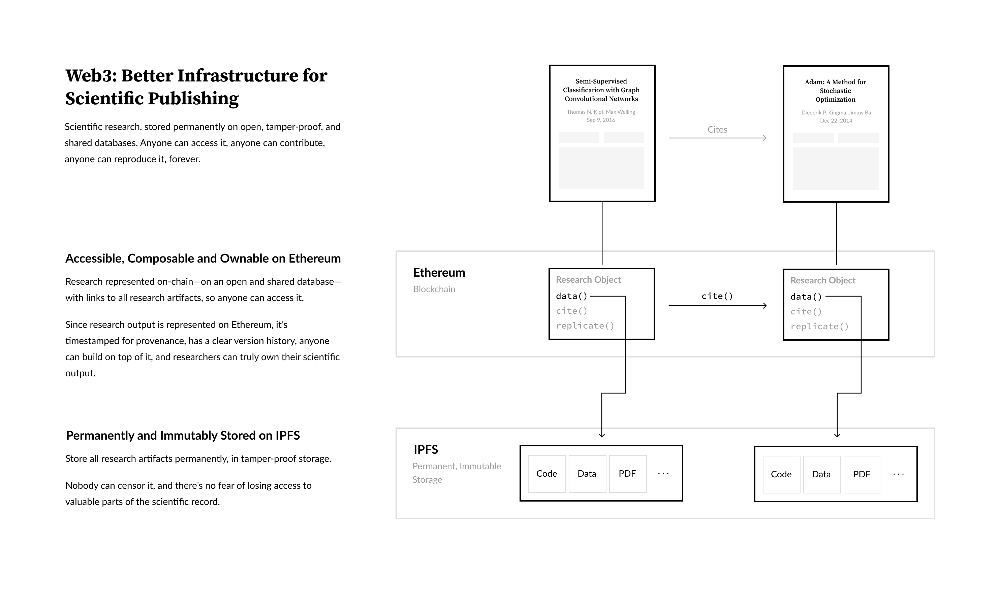

# Web3 Research

A prototype on how web3 technology can enable us to build an open, immutable, reproducible, and permanently accessible scientific record.

## Credit

The original inspiration for this project was from a podcast appearance by Balaji, where he [talks about this idea](https://youtu.be/xrcRI_hYDtQ?t=3803).

Designed and built by Manveer Basra.

Thanks to Martin Alvarez-Kuglen, Vincent Weisser, Erik Van Winkle and Christopher Hill for their input and feedback.
